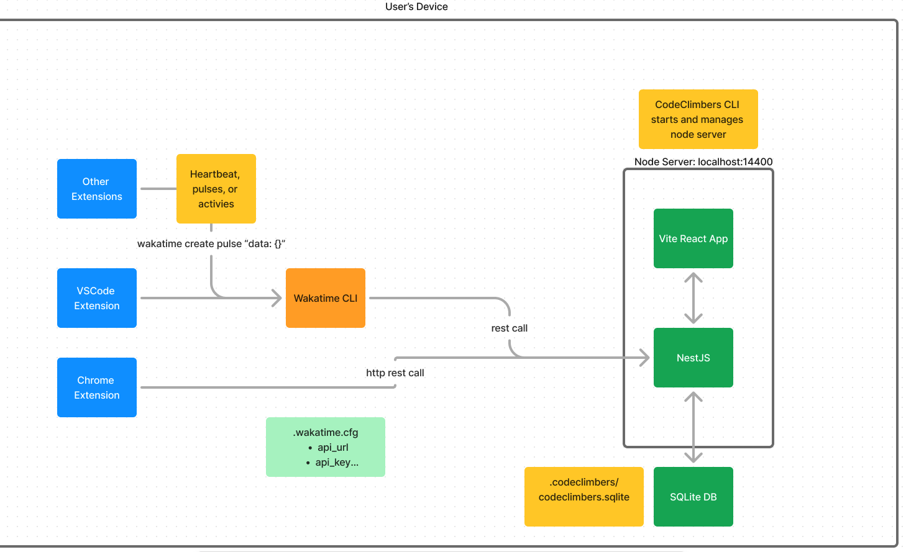

# Architecture

The information flow generally speaking looks like this:

```
extension -> wakatime cli -> codeclimbers cli -> sqlite db
```

We are making use of the wakatime cli as it is a great open source project that helps us to prototype what we are looking to build.

## Architecture Video

Took a couple minutes to talk through some of the architecture of codeclimbers
[Loom Video](https://www.loom.com/share/36a7fc061fa3415aac550c4f63a1618e?sid=fee45422-4c38-4179-ac3f-7805cb5f81d5)

## Information Flow



## Activity | Pulse | Heartbeat

The definition of the fields for an activity can be found in [pulse.d.ts](../packages/server/src/v1/pulse/infrastructure/database/models/pulse.d.ts)

## Vocab

- `Heartbeat, pulse or activity`: An individual record that represents a user using a particular application. They contain information like the file or url, the category of the action, and the git project or branch being worked on. The 3 terms are used interchangeably in the project. Wakatime refers to them as heartbeats.
- `extension or plugin`: installed to applicaitons like VSCode, Chrome, etc... that capture user activity and send it to the cli.
- `wakatime`: open source platform for tracking time. We leverage it to help us build our version more quickly as we can focus on what is unique to us rather than time tracking
